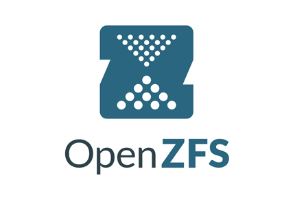

# Sistemas de ficheros avanzados ZFS

#### Vamos a crear un escenario de trabajo en Debian, con varios discos con sistema de fichero ZFS (OpenZFS). Trabajaremos con este escenario para realizar pruebas de  compresión, cow, deduplicación, cifrado para saber como se maneja este sitema de ficheros.

* Crearemos un escenario que incluya una máquina y varios discos asociados a ella.
* Instalaremos, si es necesario, el software de ZFS.
* Gestionaremos los discos adicionales con ZFS.
* Configuraremos los discos en RAID, haciendo pruebas de fallo de algún disco y sustitución, restauración del RAID. Comentaremos ventajas e inconvenientes respecto al uso de RAID software con mdadm.
* Realizaremos ejercicios con pruebas de funcionamiento de las principales funcionalidades: compresión, cow, deduplicación, cifrado, etc.
